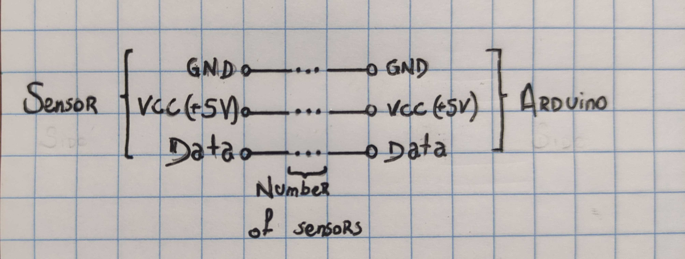
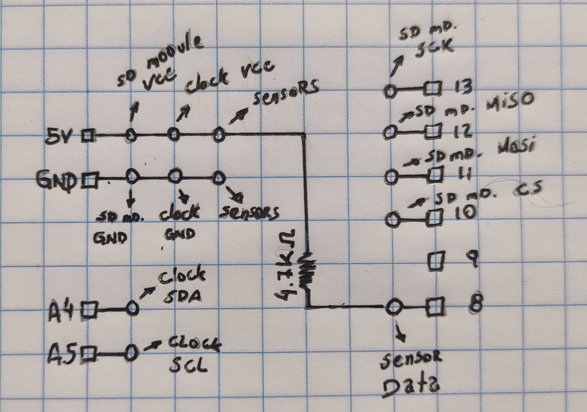

# Soil Temperature Data logger

## List of Contents

1. [Objective](#objective)
2. [Data logger working flow](#data-logger-working-flow)
3. [List of Materials](#list-of-materials)
4. [Circuit Boards](#circuit-boards)
5. [Algorithm](#algorithm)
6. [3D Files](#3d-files)
7. [Future works](#future-works)

---

## Objective
Develop a data logger to collect soil temperature in a growth chamber using Arduino e temperature sensors. It works with batteries and save the sensor data along with the date and time into a microSD card.

---

## Data logger working flow
Into a loop that repeats every 3 hours, the sensors get the temperature value (on a delay of 1 second between each sensor reading) and store into a .txt file. The .txt file is in a microSD card. Along with the sensors' reading data, the date and time is also sent to the .txt file.

The final .txt file is a line per reading with date, hour and sensors' data, all separated by commas.

---

## List of Materials

| Material | Amount | Description | Price (USD) |
|----------- | ----------- | ----------- | ----------- |
| Arduino Uno | 1 | This is the brain, where the sensors will be plugged in and information passed to the SD card | 10 |
| Sensors ds18b20 | 24 | They will read the soil temperature | 52.8 |
| RTC Watch + Coin Battery | 1 | Provides the minute/hour/date/month/year | 3 |
| Power supply adaptor | 1 | Power supply | 7.5 |
| Arduino Enclosure | 1 | To protect everything | 12 |
| microSD card module | 1 | The device that will transfer the information to the microSD card | 5.5 |
| microSD card 32 GB | 1 | Where the data will be stored | 3.6 |
| PCBs, soldering, male and female pins | X | Connect the electronic parts of sensors and other modules to the Arduino | 2 |
| |  | **Total** | 96.4 |

 

---

## Circuit Boards
Two circuit boards were made:
1. Connection of all the sensors in parallel. This one was left outside to not open 24 holes in the enclosure. Just 3 wires (VCC, ground and data) were passed through the enclosure. They were soldered in the board according to the sensors' terminals;
2. Arduino shield. This board was designed to be connected to the Arduino via male pins and connect with the other modules and the sensors' board with female pins. 

From the images bellow, circuit boards were designed in LibreCAD program. The files containing the circuit boards' draws are in the folder Circuit, with the name PCB.dxf.

**
Sensors' circuit board schema
**

**
**Arduino shield schema**
**

---

## Algorithm
The algorithm was made in C++ using Arduino IDE, since it is for Arduino. It is located in the Algorithm folder. The algorithm is structured as followed:
- Inclusion of libraries for SD card, RTC clock, temperature sensor and to put Arduino to sleep;
- Declaration of variables;
- Setup, that only runs once when the Arduino is restarted. On this function, i) the sensors are initialized, counted, located and displayed in the screen the hexadecimal address of each one; ii) the clock is initialized and adjusted only once; iii) initialize the microSD card;
- Loop, that keep running. On this function, i) the date and time information is stored in a variable, ii) the temperatures data are gotten, iii) the .txt file is opened, iv) date and time are printed in the .txt file, v) in a loop, the temperatures of the 24 sensors are obtained and printed in the .txt file with a delay of 1s between each reading, vi) a new line is printed in the .txt file, and it is closed and lastly, vii) the Arduino sleeps for the amount of period selected;
- Function to print the hexadecimal address of each found sensor.

---

## 3D Files
The 3D files were designed by own author in Fusion360 and printed in a Creality filament 3D printer. All the STL files are in the folder "3D Files". They are holders to stick in place the Arduino, sensors' board, RTC and microSD Card modules.

---

## Future works

The future work is to connect the data loggers to the internet and upload the data to the cloud. With the data into an online database, there is no need of removing and reading the microSD card and inserting automatic analysis and chart plotting.